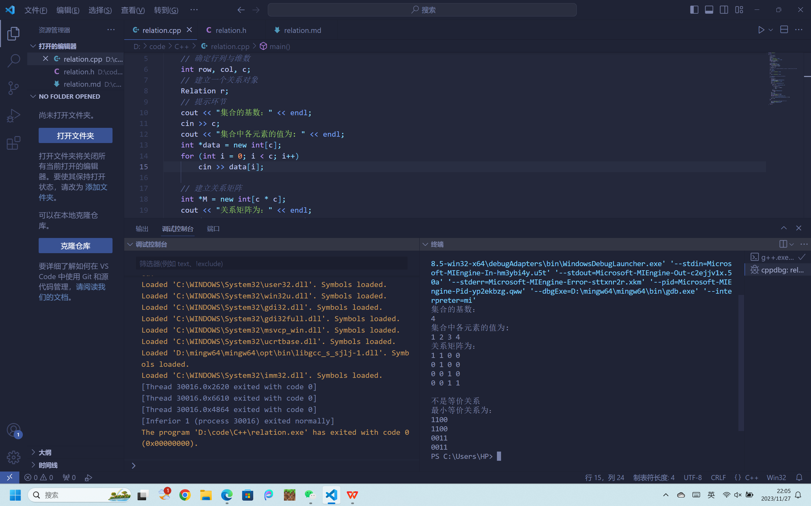
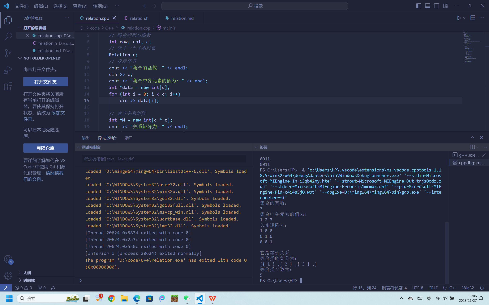

# 离散数学实践作业

### 姓名：鄂日启

### 学号：22301145

### 运算符重载：

```cpp
// 赋值运算符重载
Relation &Relation::operator=(const Relation &r)
{
    cardinality = r.cardinality;
    Matrix = new int[cardinality * cardinality];
    memcpy(Matrix, r.Matrix, sizeof(int) * cardinality * cardinality);
    return *this;
}
```

直接进行关系矩阵的全赋值和集合基数的赋值

## （1）试使用关系性质判断的等价条件（如：自反、对称、传递）判断关系R是否是等价关系？

```cpp
// 自反性
bool Relation::IsReflexive() const
{
    for (int i = 0; i < cardinality; ++i)
    {
        if (GetPosition(i, i) == 0)
            return false;
    }
    return true;
}

// 对称性
bool Relation::IsSymmetric() const
{
    for (int i = 0; i < cardinality - 1; ++i)
    {
        for (int j = i; j < cardinality; ++j)
        {
            if (GetPosition(i, j) != GetPosition(j, i))
            {
                return false;
            }
        }
    }
    return true;
}

// 传递性
bool Relation::IsTransitive() const
{
    // Toco：判断该关系的性质
    for (int i = 0; i < cardinality; ++i)
    {
        for (int j = 0; j < cardinality; ++j)
        {
            for (int k = 0; k < cardinality; ++k)
            {
                if (GetPosition(i, j) == 1 && GetPosition(j, k) == 1 && GetPosition(i, k) != 1)
                {
                    return false;
                }
            }
        }
    }
    return true;
}

// 判断该关系是否是一个等价关系
bool Relation::IsEqual() const
{
    return IsReflexive() && IsSymmetric() && IsTransitive();
}
```

- 分别判断该关系是否可以自反，对称，传递，在IsEqual中判断返回bool类型值
- 在main函数中接收一个bool信号
  
  ## （2）若R是等价关系，则求由R诱导的集合A的划分
  
  ```cpp
  void Relation::EqualClasses(int *result) const
  {
    for (int h = 0; h < cardinality; h++)
    {
        result[h] = 0;
    }
    if (IsEqual())
    {
        int min = 0; // 当前的最大等价类编号
        for (int i = 0; i < cardinality; i++)
        { // 目标列编号
            for (int j = 0; j <= i; j++)
            { // 当前扫描的列的编号
                bool flag = false;
                for (int k = 0; k < cardinality; k++)
                { // 行对比的循环
                    if (GetPosition(k, i) != GetPosition(k, j))
                    {
                        flag = true;
                        break;
                    }
                }
                if (!flag)
                { // 存在相同的列
                    if (j != i)
                    { // 与之前某列相同
                        result[i] = result[j];
                    }
                    else
                    { // 自己与自己相同
                        result[i] = min;
                        min++;
                    }
                    break;
                }
            }
        }
    }
    else
    {
        memset(result, 255, sizeof(int) * cardinality);
    }
  }
  ```
  - result是一个大小为cardinality的数组，
  - 如果当前关系是等价关系，则result中存放的是当前关系的各个元素所在等价类的编号，返回true；
  - 否则result数组中任一项的值都是-1，并返回false。
  - 具体在控制台中的打印如下：

```cpp
cout << "等价类的划分为：" << endl;

        cout << "{";
        for (i = 0; i < r.GetCardinality(); i++)
        {
            cout << "{";
            for (j = 0; j < r.GetCardinality(); j++)
            {
                if (EClass[j] == i)
                {
                    cout << " " << data[j];
                    flag++;
                }
            }
            cout << " } ,";
            if (flag == r.GetCardinality())
                break;
        }
        cout << "}";
        cout << endl;
```

## （3）若R不是等价关系，则求包含R最小的等价关系

```cpp
// 返回自反闭包的关系矩阵
Relation Relation::ReflexiveClosure() const
{
    int *m = new int[cardinality * cardinality];
    GetMatrix(m);

    for (int i = 0; i < cardinality; i++)
    {
        if (m[i * cardinality + i] != 1)
            m[i * cardinality + i] = 1;
    }

    Relation r(cardinality, m);
    return r;
}

// 返回对称闭包的关系矩阵
Relation Relation::SymmetricClosure() const
{
    int *m = new int[cardinality * cardinality];
    GetMatrix(m);
    int *temp = new int[cardinality * cardinality];
    for (int i = 0; i < cardinality; ++i)
    {
        for (int j = 0; j < cardinality; ++j)
        {
            temp[i * cardinality + j] = temp[j * cardinality + i] = m[i * cardinality + j] || m[j * cardinality + i];
        }
    }

    Relation r(cardinality, temp);
    return r;
}

// 返回传递闭包的关系矩阵
Relation Relation::TransitiveClosure() const
{
    int *m = new int[cardinality * cardinality];
    GetMatrix(m);

    for (int i = 0; i < cardinality; i++)
    {
        for (int j = 0; j < cardinality; j++)
        {
            if (m[j * cardinality + i] == 1)
            {
                for (int k = 0; k < cardinality; k++)
                {
                    m[j * cardinality + k] = (m[j * cardinality + k] || m[i * cardinality + k]);
                }
            }
        }
    }
    Relation r(cardinality, m);
    return r;
}

Relation Relation::minEquivalence() const
{
    return ReflexiveClosure().SymmetricClosure().TransitiveClosure();
}
```

- 先求自反闭包，再求对称闭包，最后求传递闭包
- 结合之后可得到最小等价关系

## （4）求集合A上等价关系的个数

```cpp
long long int Relation::numOfequalClasses(int n, int m)
{
    if (m == 1 || n == m)
        return 1;
    else
        return numOfequalClasses(n - 1, m - 1) + numOfequalClasses(n - 1, m) * m;
}
```

```cpp
// （4）求集合A上等价关系的个数。
        cout << "等价类个数为：" << endl;
        long long int sum = 0;
        for (int i = 1; i <= r.GetCardinality(); i++)
        {
            sum = r.numOfequalClasses(r.GetCardinality(), i) + sum;
        }
        cout << sum;
```

- 1)若m==1，则f(n,m)=1;

- 2)若n==m，则f(n,m)=1;

- 3)若非以上两种情况，f(n,m)可以由下面两种情况构成
  
  - 向n-1个元素划分成的m个集合里面添加一个新的元素，则有m*f(n-1,m)种方法；
  
  - 向n-1个元素划分成的m-1个集合里添加一个由一个元素形成的独立的集合，则有f(n-1,m-1)种方法
    
    ## 测试：
    
        